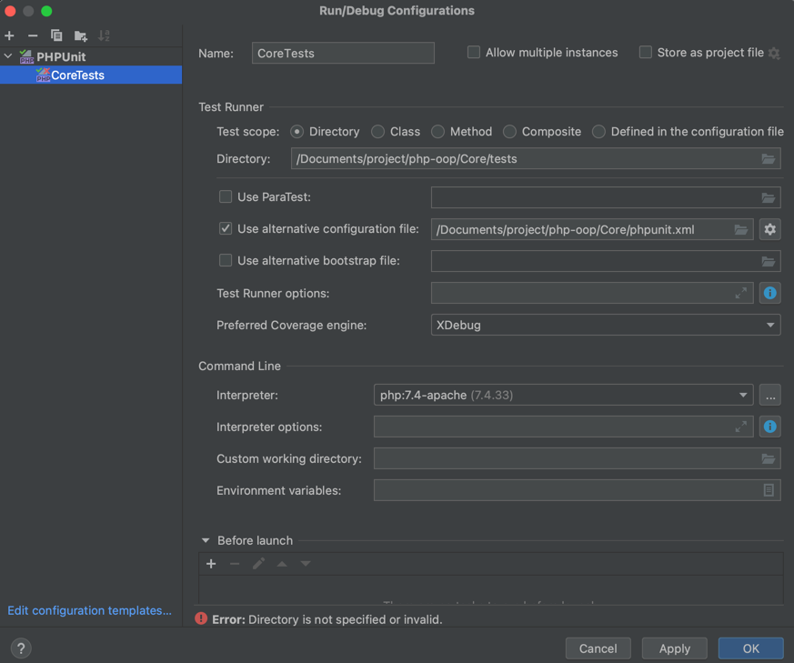
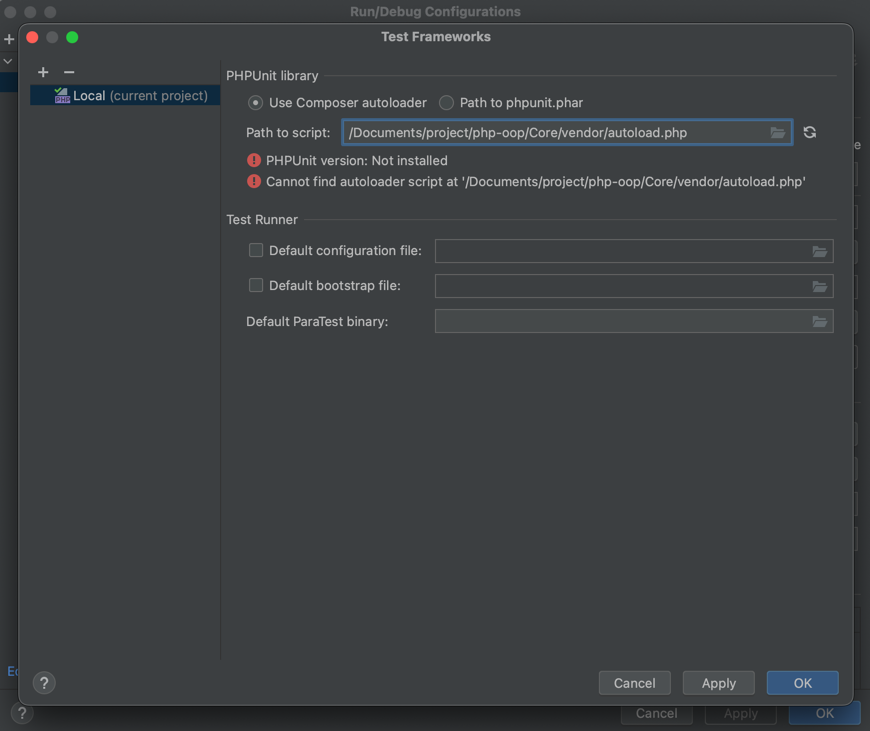
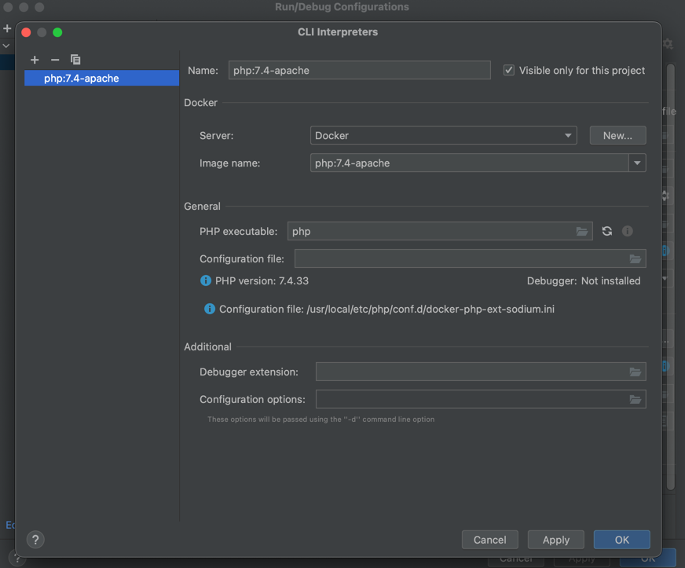

# OOP, DDD, TDD, Design Patterns 구현 정리

## 버전 정보
    Core: PHP v7.4
    Framework/Codeigniter: PHP v7.4 Codeigniter v3.0
    Framework/Laravel PHP v8.1 Laravel v9.1

## 개발 환경 설정
    
### Database
    docker run --name mysql-5.7 -e MYSQL_ROOT_PASSWORD={password} -d -p 3306:3306 mysql:5.7

### Codeigniter
    $ cd ./Codeigniter
    $ docker-compose build --no-cache
    $ docker-compose up -d

### Laravel
    $ cd ./Laravel
    $ docker-compose build --no-cache
    $ docker-compose up -d

## 테스트 환경 설정

### PhpStorm

